# Классификация CIFAR-10

## Задание

Решите задачу классификации изображений на наборе данных с фотографиями животных (например, набор данных CIFAR-10).

## Датасет CIFAR-10

Датасет имеет 60000 изображений. Каждое изображение цветное, имеет формат 32x32. Изображения разделены на взаимоисключающие классы. Общее количество классов - 10 (самолет, автомобиль, птица, кот, олень, собака, лягушка, лошадь, корабль, грузовик).

Набор данных разделен на обучающую (50000), и тестовую (10000) выборки.  
Каждая выборка имеет равномерное распределение экземпляров классов.

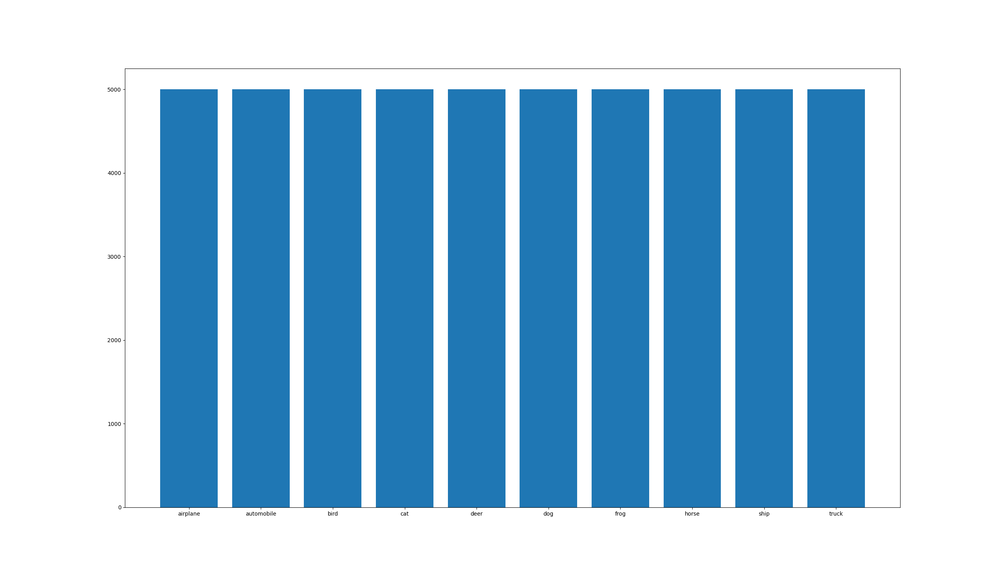

## Выбор моделей

 В сравнение были выбраны следующие модели

* Random Forest (классификационный случайный лес).
* SVC (опорно-векторная классификация).
* Бустинговые алгоритмы:
    * AdaBoost.
    * XGBoost.
* Нейронные сети:
    * Sequential dense NN (многослойный перцептрон).
    * CNN (сверточная нейронная сеть).

## Сравнение результатов

В таблице приведены результаты работы моделей. Наибольщую точность показала CNN (72.41).

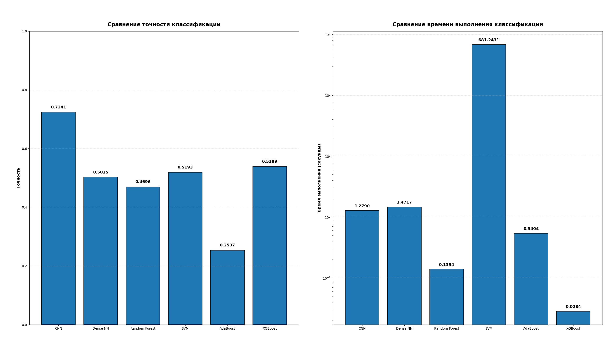

### CNN

#### Архитектура

| Layer (type) | Output Shape | Param # |
|--------------|--------------|---------|
| input_layer (InputLayer) | (None, 32, 32, 3) | 0 |
| conv2d (Conv2D) | (None, 30, 30, 32) | 896 |
| max_pooling2d (MaxPooling2D) | (None, 15, 15, 32) | 0 |
| conv2d_1 (Conv2D) | (None, 13, 13, 64) | 18,496 |
| max_pooling2d_1 (MaxPooling2D) | (None, 6, 6, 64) | 0 |
| conv2d_2 (Conv2D) | (None, 4, 4, 128) | 73,856 |
| flatten (Flatten) | (None, 2048) | 0 |
| dense (Dense) | (None, 1536) | 3,147,264 |
| dropout (Dropout) | (None, 1536) | 0 |
| dense_1 (Dense) | (None, 10) | 15,370 |

        inputs = keras.Input(shape=(32, 32, 3))
        x = layers.Conv2D(filters=32, kernel_size=3, activation='relu', padding='valid')(inputs)
        x = layers.MaxPooling2D(pool_size=2)(x)
        x = layers.Conv2D(filters=64, kernel_size=3, activation='relu', padding='valid')(x)
        x = layers.MaxPooling2D(pool_size=2)(x)
        x = layers.Conv2D(filters=128, kernel_size=3, activation='relu', padding='valid')(x)
        x = layers.Flatten()(x)
        x = layers.Dense(1536, activation='relu')(x)
        x = layers.Dropout(0.2)(x)
        outputs = layers.Dense(10, activation='softmax')(x)
        self.model = keras.Model(inputs = inputs, outputs = outputs)
        self.model.compile(optimizer='adam',
                           loss="sparse_categorical_crossentropy",
                           metrics=["accuracy"])

#### Обучение 

График точности:

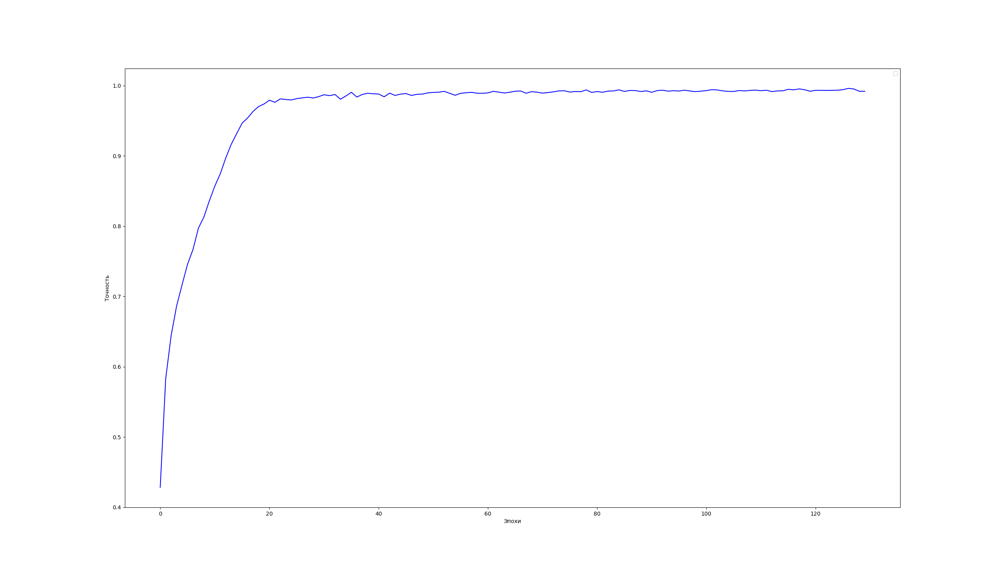

График потерь:

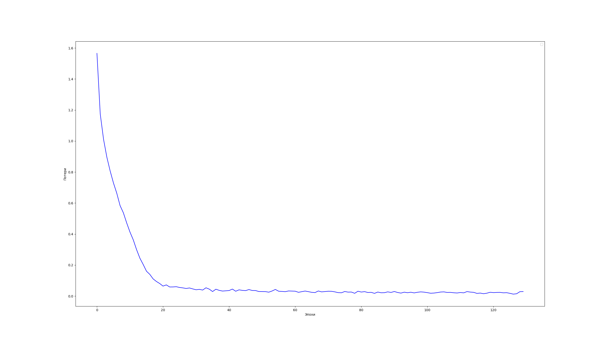

Результат на тестовой выборке: 

            Выполнено за 1.2790 секунд 
            Точность модели: 0.7241
            Метрики качества:
              precision    recall  f1-score   support

           0       0.73      0.79      0.76      1000
           1       0.81      0.87      0.84      1000
           2       0.64      0.62      0.63      1000
           3       0.57      0.48      0.52      1000
           4       0.71      0.61      0.65      1000
           5       0.63      0.64      0.63      1000
           6       0.70      0.86      0.77      1000
           7       0.78      0.76      0.77      1000
           8       0.82      0.84      0.83      1000
           9       0.83      0.79      0.81      1000

           accuracy                           0.72     10000
           macro avg       0.72      0.72     0.72     10000
        weighted avg       0.72      0.72     0.72     10000

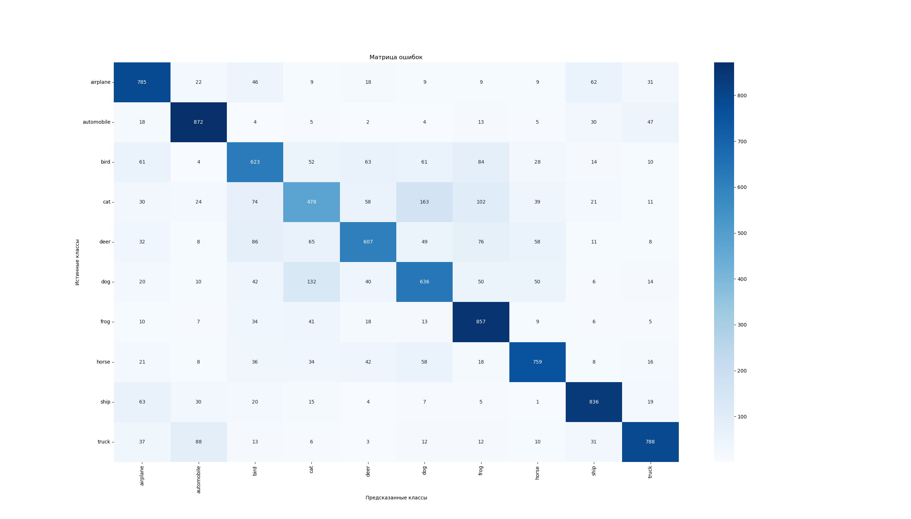

### Sequential dense NN

#### Архитектура

        self.model = keras.Sequential([
            layers.Dense(4096, activation="relu"),
            layers.Dense(512, activation='relu'),
            layers.Dense(10, activation="softmax")
        ])
        self.model.compile(optimizer='adam',
                           loss="sparse_categorical_crossentropy",
                           metrics=["accuracy"])
        self.model.summary()

#### Обучение

График точности:

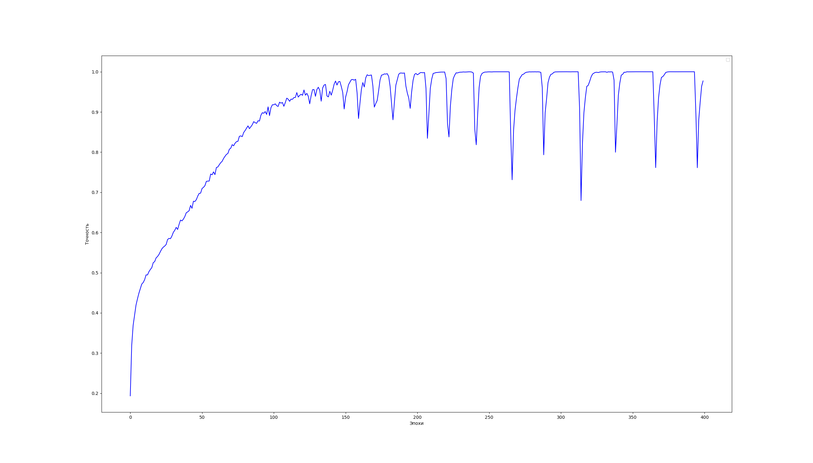

График потерь:

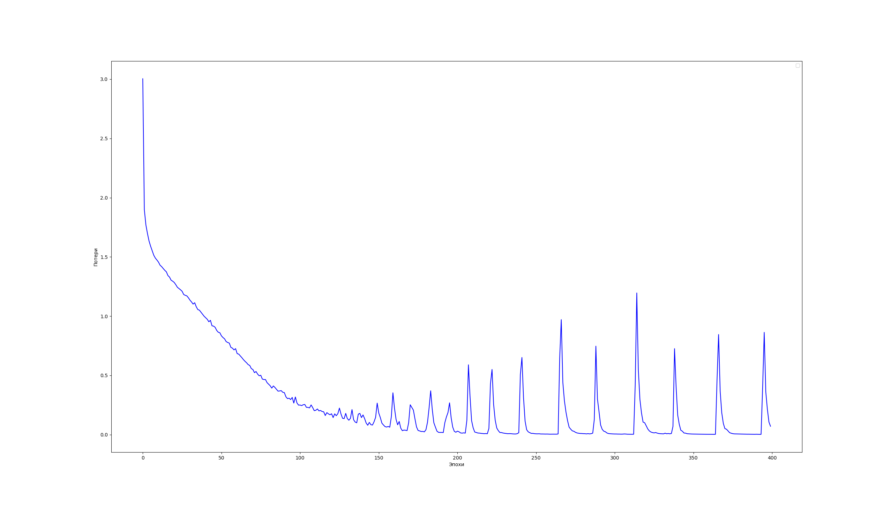

Результат на тестовой выборке: 

        Выполнено за 1.4717 секунд 
        Точность модели: 0.5025
        Метрики качества:
              precision    recall  f1-score   support

           0       0.55      0.62      0.58      1000
           1       0.63      0.59      0.61      1000
           2       0.36      0.48      0.41      1000
           3       0.34      0.33      0.33      1000
           4       0.48      0.35      0.40      1000
           5       0.41      0.40      0.41      1000
           6       0.59      0.50      0.54      1000
           7       0.52      0.61      0.56      1000
           8       0.62      0.64      0.63      1000
           9       0.58      0.51      0.54      1000

           accuracy                           0.50     10000
          macro avg       0.51      0.50      0.50     10000
       weighted avg       0.51      0.50      0.50     10000

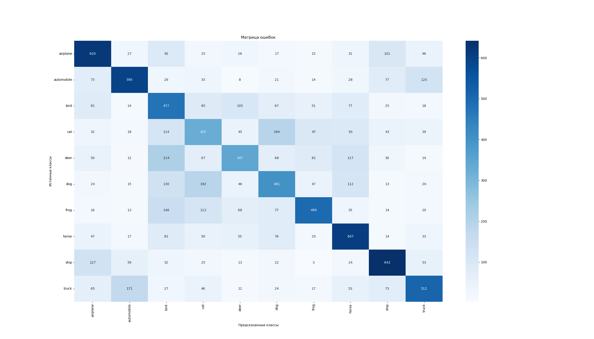

### Random forest

        Выполнено за 0.1394 секунд
        Точность модели: 0.4696
        Метрики качества:
              precision    recall  f1-score   support

           0       0.53      0.55      0.54      1000
           1       0.52      0.54      0.53      1000
           2       0.40      0.33      0.36      1000
           3       0.34      0.26      0.29      1000
           4       0.40      0.41      0.40      1000
           5       0.41      0.41      0.41      1000
           6       0.47      0.56      0.51      1000
           7       0.53      0.46      0.50      1000
           8       0.57      0.62      0.59      1000
           9       0.47      0.57      0.51      1000

          accuracy                           0.47     10000
          macro avg       0.46      0.47     0.47     10000
       weighted avg       0.46      0.47     0.47     10000

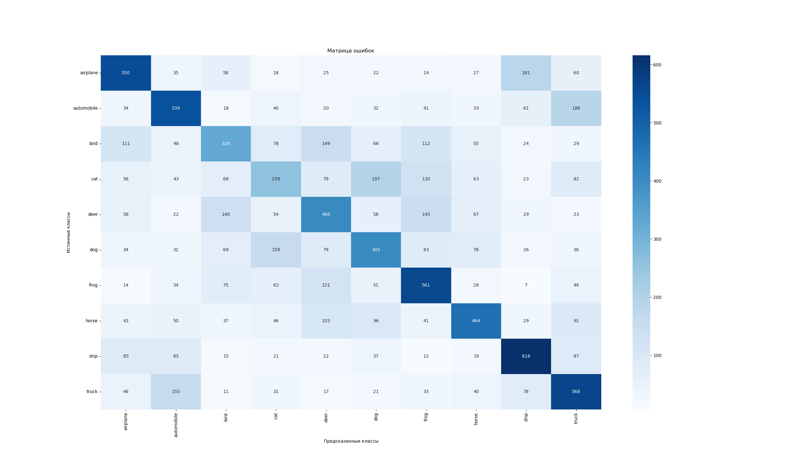

### SVM

        Выполнено за 681.2431 секунд
        Точность модели: 0.5193
        Метрики качества:
              precision    recall  f1-score   support

           0       0.59      0.58      0.59      1000
           1       0.61      0.62      0.62      1000
           2       0.40      0.37      0.39      1000
           3       0.36      0.37      0.37      1000
           4       0.45      0.41      0.43      1000
           5       0.47      0.40      0.44      1000
           6       0.51      0.62      0.56      1000
           7       0.60      0.53      0.56      1000
           8       0.62      0.67      0.64      1000
           9       0.55      0.60      0.58      1000

          accuracy                           0.52     10000
          macro avg       0.52      0.52     0.52     10000
       weighted avg       0.52      0.52     0.52     10000
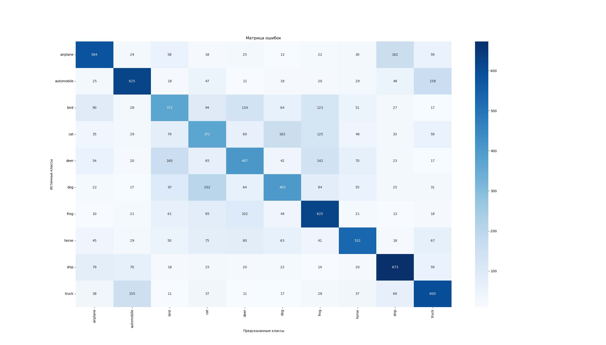

### AdaBoost
        Выполнено за 0.5404 секунд
        Точность модели: 0.2537
        Метрики качества:
              precision    recall  f1-score   support

           0       0.31      0.39      0.35      1000
           1       0.34      0.32      0.33      1000
           2       0.16      0.32      0.22      1000
           3       0.17      0.14      0.15      1000
           4       0.17      0.11      0.13      1000
           5       0.27      0.20      0.23      1000
           6       0.26      0.19      0.22      1000
           7       0.25      0.22      0.23      1000
           8       0.31      0.35      0.33      1000
           9       0.35      0.30      0.32      1000

          accuracy                           0.25     10000
          macro avg       0.26      0.25     0.25     10000
       weighted avg       0.26      0.25     0.25     10000
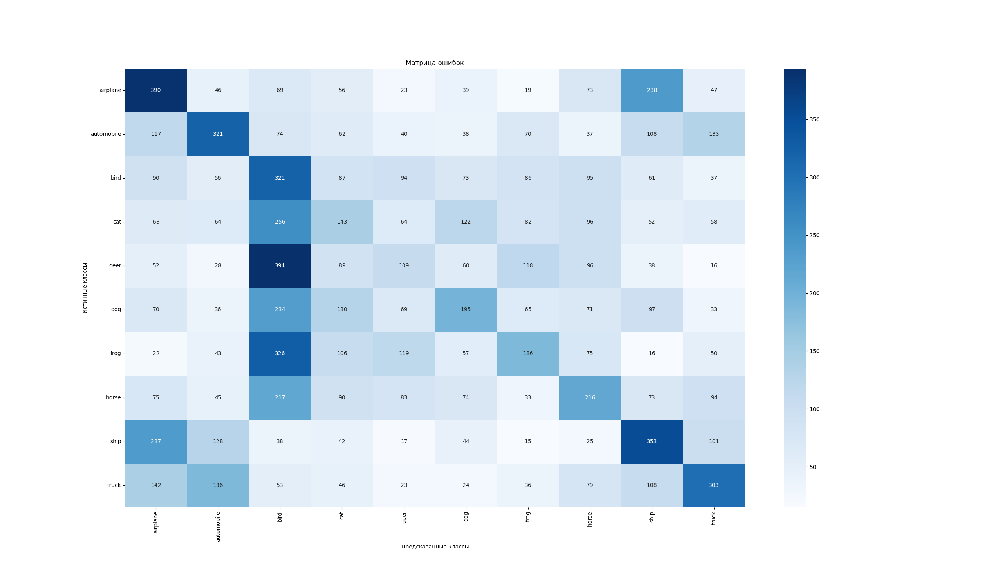

### XGBoost
        Выполнено за 0.0284 секунд
        Точность модели: 0.5389
        Метрики качества:
              precision    recall  f1-score   support

           0       0.61      0.60      0.61      1000
           1       0.66      0.64      0.65      1000
           2       0.43      0.40      0.41      1000
           3       0.38      0.37      0.37      1000
           4       0.45      0.45      0.45      1000
           5       0.47      0.47      0.47      1000
           6       0.55      0.64      0.59      1000
           7       0.60      0.55      0.58      1000
           8       0.65      0.68      0.66      1000
           9       0.58      0.59      0.58      1000

           accuracy                           0.54     10000
           macro avg       0.54      0.54     0.54     10000
        weighted avg       0.54      0.54     0.54     10000
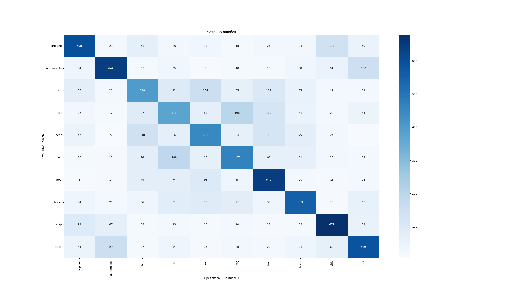

