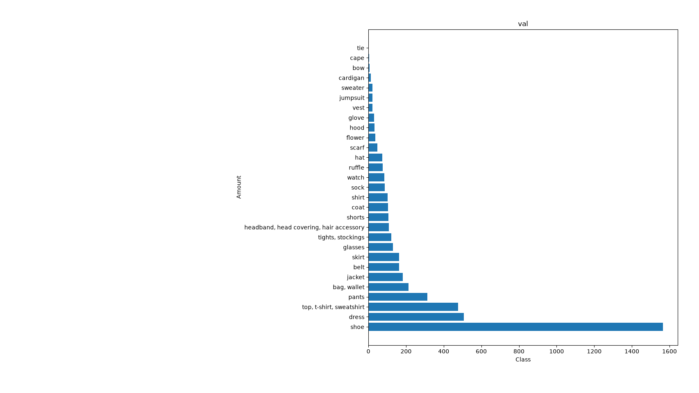
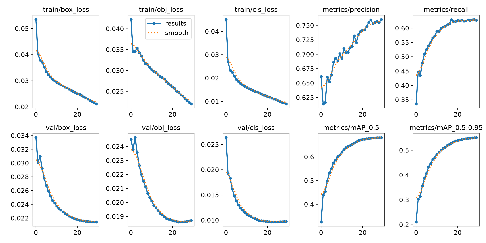
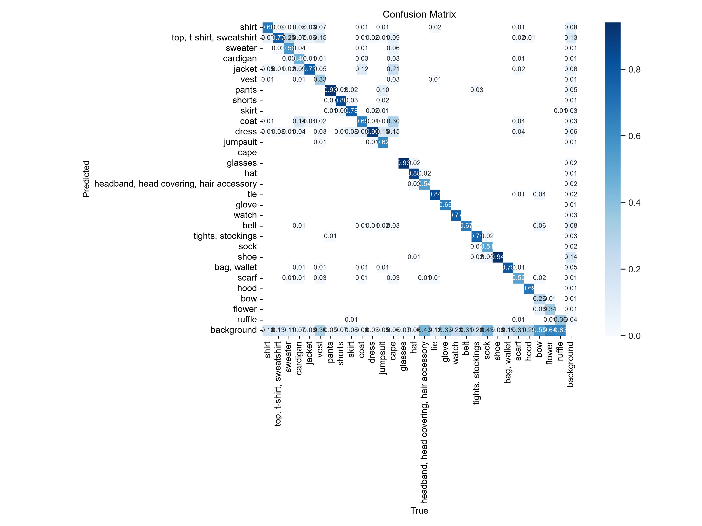
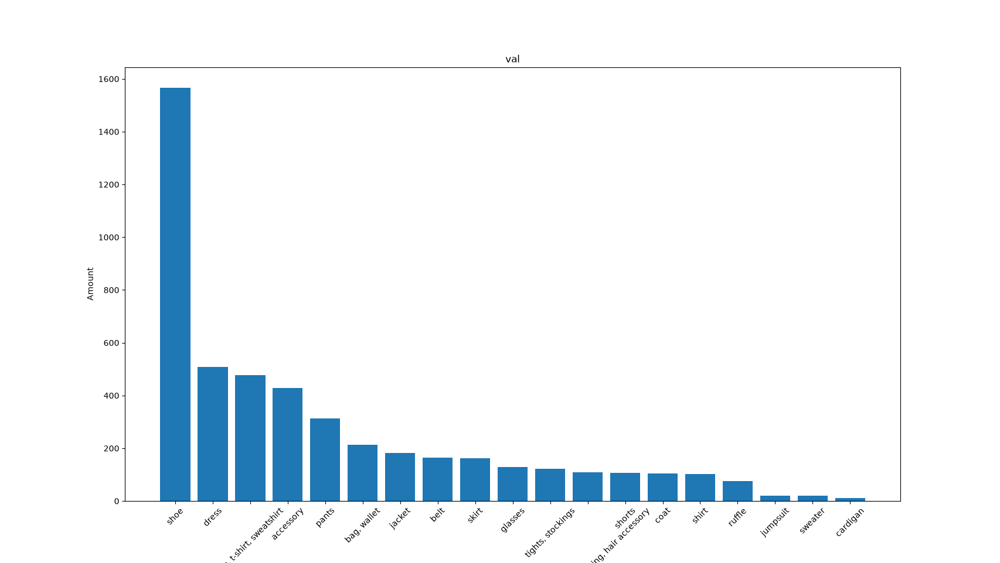
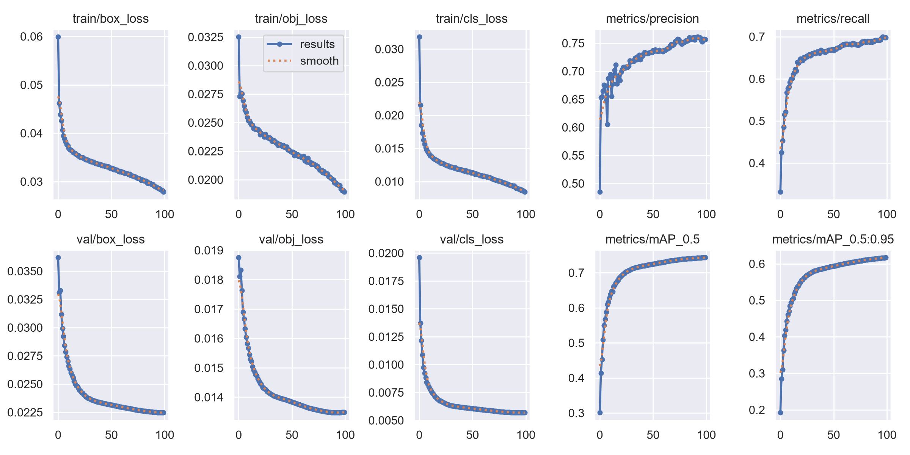
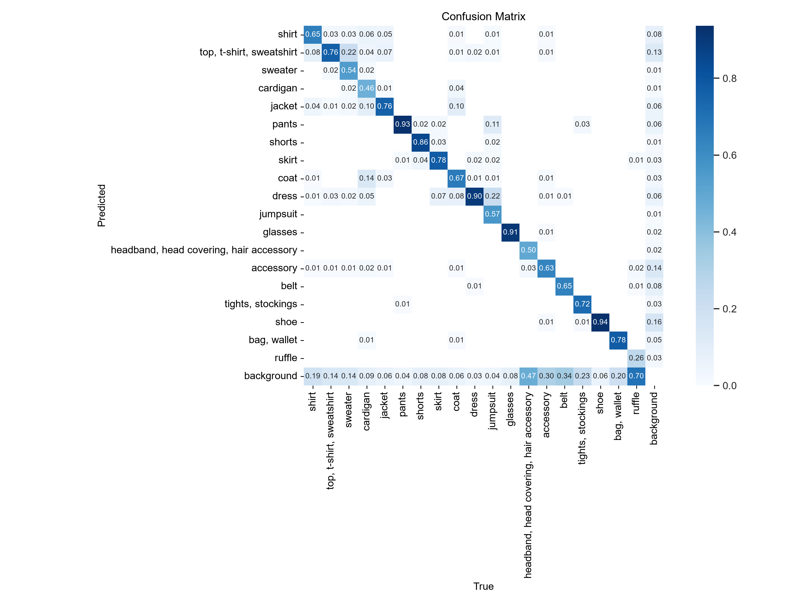
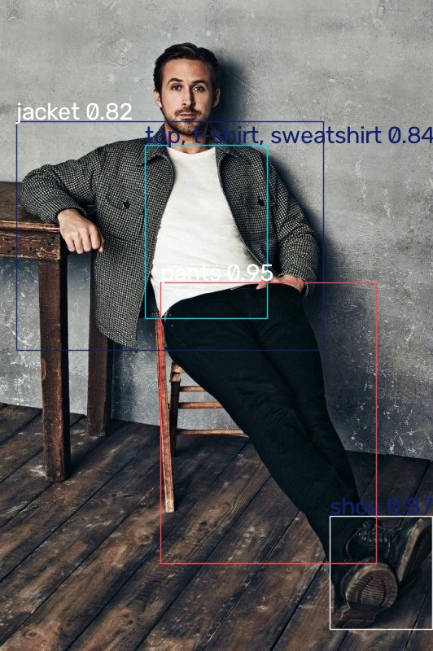
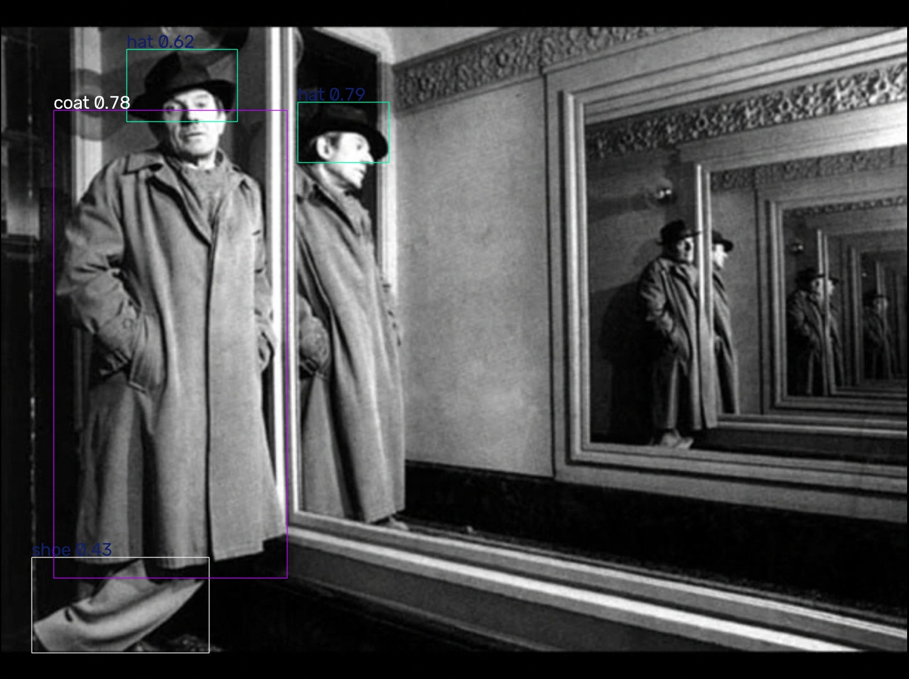
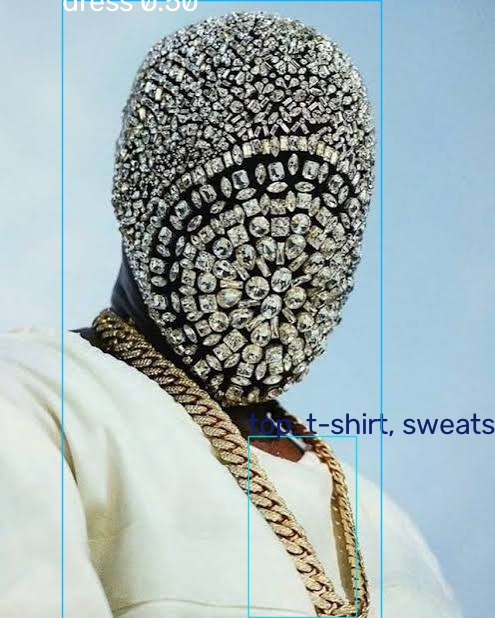
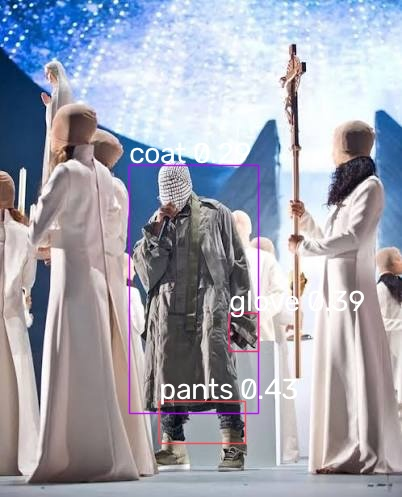

# Обучение YOLOv5

Реализовать yolo для детекции, сегментации или трекинга объектов в режиме реального времени исходя из своих интересов

## Датасет

 [Fashionpedia-dataset](https://www.kaggle.com/datasets/pchhalotre321chh/fashionpedia-dataset) - размеченные согласно стандарту COCO изображения одежды и акссесуаров для возможности их дальнейшей детекции. В датасет входит 46 781 экземпляр 29 классов с распределением, показанным на рисунке 1.

  
 
Экземпляры классов распределены по выборкам в равной пропорции.

## Обучение

Было проведено два эксперимента.
### Эксперимент 1

Обучение производилось с моделью YOLOv5l, 30 эпох, размер батча 16, размер изображения 640 пикселей по длинной стороне. На рисунке 2 представлены метрики обучения.

| epoch | train/box_loss | train/obj_loss | train/cls_loss | metrics/precision | metrics/recall | metrics/mAP_0.5 | metrics/mAP_0.5:0.95 | val/box_loss | val/obj_loss | val/cls_loss | x/lr0 | x/lr1 | x/lr2 |
|------:|---------------:|---------------:|---------------:|------------------:|---------------:|----------------:|---------------------:|-------------:|-------------:|-------------:|------:|------:|------:|
| 29    | 0.021179       | 0.021999       | 0.0089606      | 0.76031           | 0.62761        | 0.6817          | 0.55099              | 0.021434     | 0.018716     | 0.0097428    | 0.00076 | 0.00076 | 0.00076 |

 
 *Рис. 2. Метрики обучения первого эксперимента*

 Метрики показывают, что обучение необходимо проводить в течении большего количества эпох.

 Из матрицы ошибок на рисунке 3 следуюет, что некоторые классы совершенно не детектируются моделью (определяются как автоматически добавляемый YOLOv5 класс фон). Это определено неравномерностью распределения экземпляров классов.

 
 *Рис. 3. Матрица ошибок*

### Эксперимент 2

Второй эксперимент был скорректирован согласно [комментария](https://github.com/ultralytics/yolov5/issues/5851) путем увеличения размера батча до 24 (максимумальный для видеокарты, на которой проходит обучение). Также была выбрана менее требовательная модель YOLOv5m.

В резулбтате анализа первого эксперимента сделано следующее:
- Несколько классов в датасете были объединены в один путем корректирования меток и файла конфигурации. В результате получено распределение, показанное на рисунке 4.

 
 *Рис. 4. Распределение экземпляров классов в обучающей выборке после корректировки*

- Количество эпох увеличено до 100.В [комментарии](https://github.com/ultralytics/yolov5/issues/5851) предлагается начинать с 300 эпох и постепенно увеличивать, но 100 выбрано ввиду ограничений по железу и времени (на 100 эпох ушло 27 часов).

- Усилена аугментация путем смены конфигурационного файла через флаг --hyp data/hyps/hyp.scratch-med.yaml.

Результаты представлены на рисунках 5 и 6.

 
 *Рис. 2. Метрики обучения второго эксперимента*

 
 *Рис. 3. Матрица ошибок второго эксперимента*

 ## Примеры

*Эталонный пример, хороший результат.*

 
 *Правильно определено пальто и две шляпы, штанина ошибочно принята за обувь. Скорее всего проблема в цвете, обрезанности элемента. Отражения не детектируются из-за размера, модель автоматически меняет разрешение изображения до 640 пикселей по длинной стороне с сохранением пропорции, изза чего теряется детализация и пропадают мелкие объекты.*

 
 *Сложная деталезированная маска ошибочно определена.*

 
 *Однотонная одежда актеров не определяется. Контрастное пальто угадано, но с низкой уверенностью.*

https://github.com/user-attachments/assets/829fae5c-7e34-46be-be3d-656ce85fd68e

<video src="images/example/video.mp4" controls width="600">
  Ваш браузер не поддерживает тег video.
</video>

*В видео появляется проблема, что объекты в движении может размывать, что приводит к ухудшению распознавания. Также проявляются дефекты, упомянутые ранее.*

## Выводы

На качество распознавания объектов влияет много факторов. Главными проблемами являются мелкие детали, низкая контрастность (однотонность) объектов, размытые изображения (например при быстрых движениях на видео объект в кадре размывается).

Улучшению качества распознавания может помочь: 
- Изменение модели под работу с изображениями более высокого разрешения.
- Дальнейшая работа с датасетом (убрать совсем мелкие классы). 
- Усиление аугментации размытия изображения.
- Проведение обучения с большим количеством эпох.
- Предобработка поступающих видео (попытка увеличения разборчивости однотонных изображений, увеличение контрастности).

