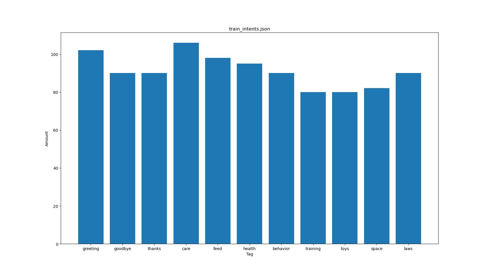
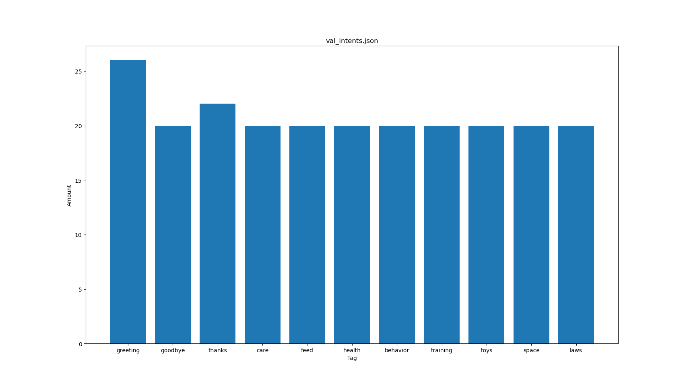
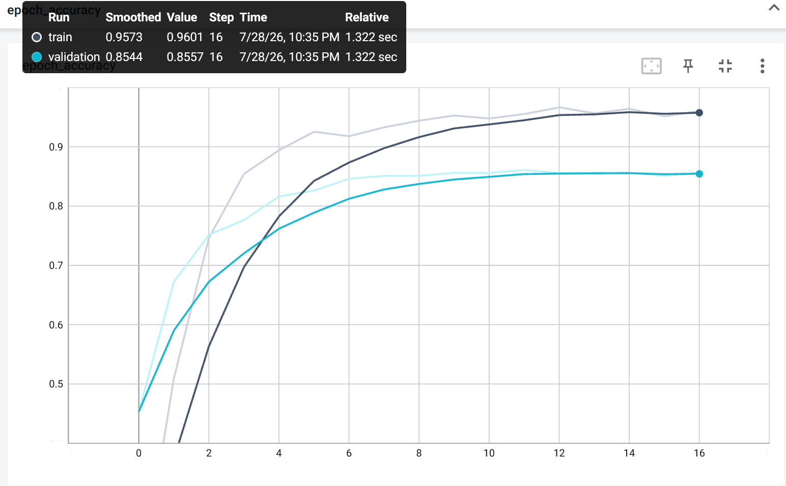
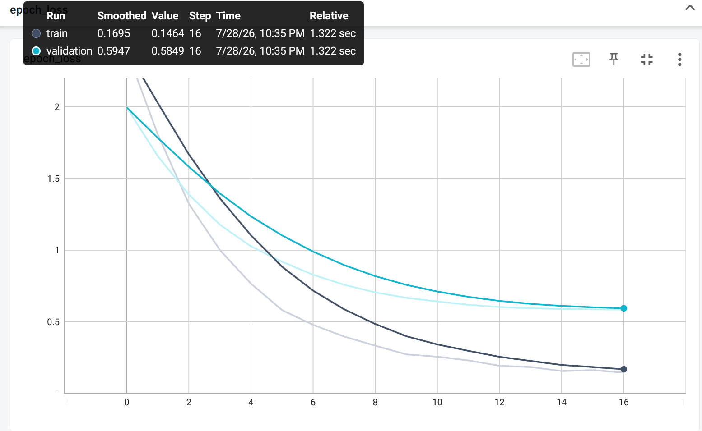
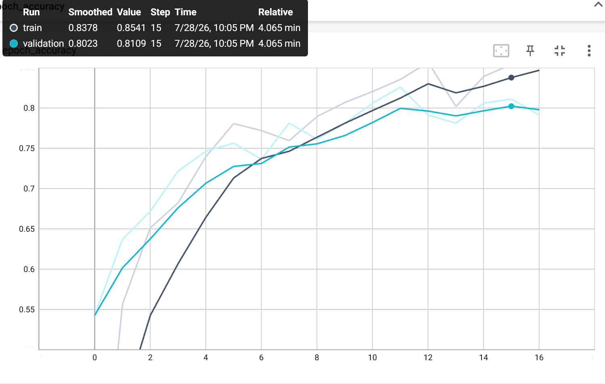
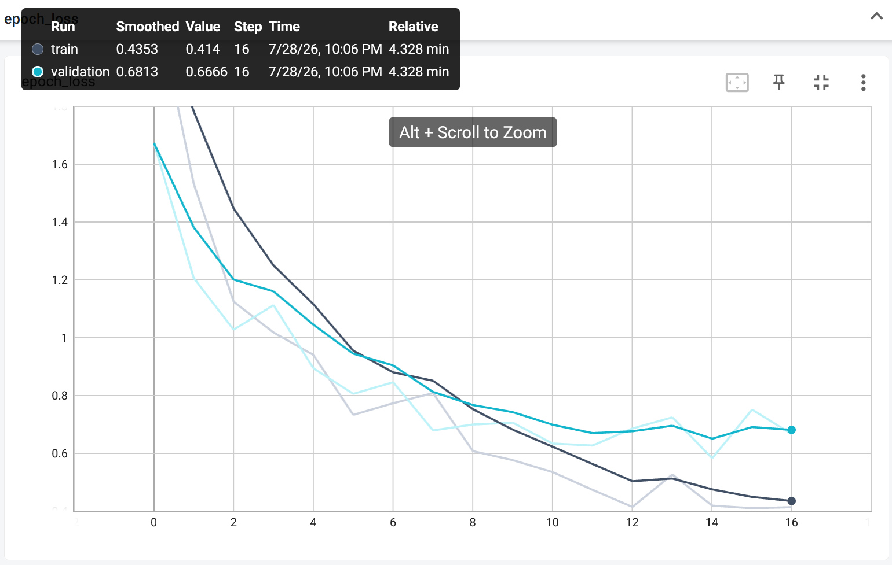

# Реализация чат-бота Telegram

Реализовать чат-бота по примеру: [pytorch chatbot](https://github.com/patrickloeber/pytorch-chatbot)
 - Список намерений составить самостоятельно;
 - Выбрать тип нейронной сети для обучения;
 - Добавить логирование хода обучения сети;
 - Добавить логирование вопросов/ответов;
 - Добавить чат бот в телеграм

## Датасет

Датасет представляет из себя список намерений. Базовый список намерений написан вручную, для каждого тега намерений было сгенерировано с помощью LLM от 80 до 100 паттернов(примеров запросов). Также были сгенерирован валидационный список намерений, при генерации была выбрана другая модель LLM с другими вручную написанными примерами паттернов.
На рисунках 1 и 2 представлено распределение паттернов.

*Рис. 1. Распределение паттернов в тренировочном наборе*

*Рис. 2. Распределение паттернов в валидационном наборе*

## Архитектуры

Реализовано две модели: 
 - полносвязная нейронная сеть с предобработкой текста путем кодирования биграмм с нормализацией TF-IDF;
 - рекуррентная нейронная сеть (lstm) с конструированием векторных представлений слов с помощью слоя embedding.

Архитектура Dense NN:

| Layer (type)             | Output Shape    | Param #   |
|--------------------------|-----------------|-----------|
| input_1 (InputLayer)     | (None, 1300)    | 0         |
| dense_3 (Dense)          | (None, 1024)    | 1,332,224 |
| dropout_3 (Dropout)      | (None, 1024)    | 0         |
| dense_4 (Dense)          | (None, 11)      | 11,275    |

==========================================================
- Total params: **1,343,499**  
- Trainable params: **1,343,499**  
- Non-trainable params: **0**

Архитектура LSTM:
## Архитектура модели

| Layer (type)               | Output Shape      | Param #   |
|----------------------------|-------------------|-----------|
| input_1 (InputLayer)       | (None, None)      | 0         |
| embedding (Embedding)      | (None, None, 300) | 306,000   |
| bidirectional (Bidirectional) | (None, None, 4096) | 38,486,016 |
| bidirectional_1 (Bidirectional) | (None, 4096)   | 100,679,680 |
| dense (Dense)              | (None, 1024)      | 4,195,328 |
| dropout (Dropout)          | (None, 1024)      | 0         |
| dense_1 (Dense)            | (None, 11)        | 11,275    |

===============================================================
- Total params: **143,678,299**  
- Trainable params: **143,372,299**  
- Non-trainable params: **306,000**

В модели использовано предобученное векторное представление слов [Russian language ELMo embeddings model](https://docs.deeppavlov.ai/en/0.1.0/intro/pretrained_vectors.html#fasttext).

В качестве порога уверенности используются минимальный уровень вероятности и разница между первым и вторым значением вероятности класса. Минимальный уровень задан как 70%, а минимальная разница - 30%.

### Обучение

Обучение проводилось на 50 эпохах с функцией early stopping и логированием tensorboard.
На рисунке 3 представлен график точности Dense NN.

 
 *Рис. 3. График точности Dense NN*

На рисунке 4 представлен график потерь Dense NN.

 
 *Рис. 4. График потерь Dense NN*

На рисунке 3 представлен график точности LSTM.

 
 *Рис. 3. График точности LSTM*

На рисунке 4 представоен график потерь LSTM.

 
 *Рис. 4. График потерь LSTM*

 ## Логирование и работа в telegram

Бот добавлен в telegram с помощью [python-telegram-bot](https://docs.python-telegram-bot.org/en/stable/)

Логирование реализовано стандартной библиотекой python в файл log.txt

В логи сохраняется сообщение пользователя, распределение вероятности тегов, максимальная вероятность и разница между первой и второй максимальной вероятностью.
Пример реализованного логирования сообщения:

    2026-07-29 18:50:13,868 - root - INFO - чем кормить котенка?
    2026-07-29 18:50:13,868 - root - INFO - 
    [[2.5400428e-07 3.2842021e-07 9.9998879e-01 2.7700280e-09 1.0714809e-09
    4.1988142e-06 4.0578367e-08 5.0206876e-07 1.7372331e-08 5.1456277e-06
    8.2871219e-07]]
    2026-07-29 18:50:13,868 - root - INFO - max pred - 0.9999887943267822
    2026-07-29 18:50:13,868 - root - INFO - margin - -7.441593652401934e-08
    2026-07-29 18:50:13,868 - root - INFO - tag - feed

На основе сообщений пользователей собран файл *evaluate.json* с целью проверки точности на реальных запросах.
Результаты проверки на 29 сообщениях:

    Dense NN - 0s 141ms/step - loss: 1.5949 - accuracy: 0.4483

    LSTM - 6s 568ms/step - loss: 1.0432 - accuracy: 0.7193

