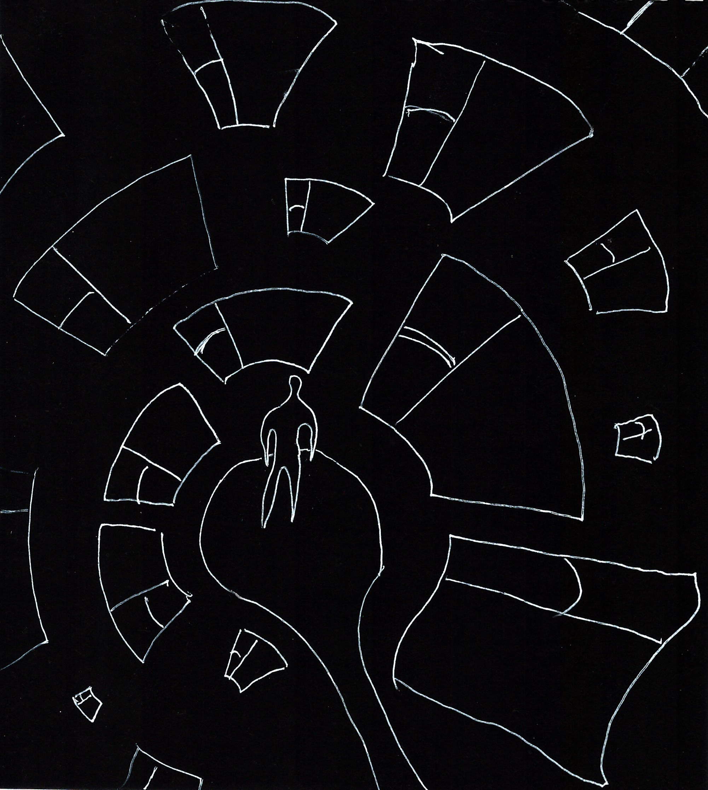
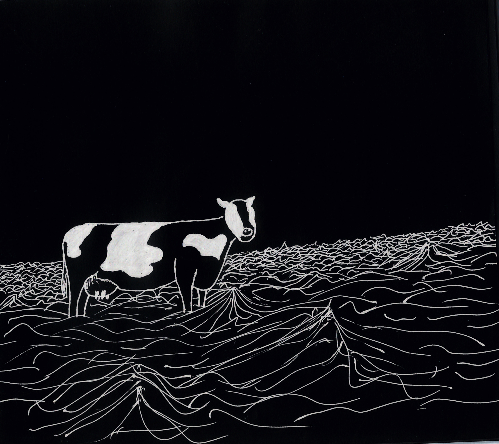

# GAN

Реализовать GAN на выбор.

Реализовать генерацию изображений в определенном стиле (рисунки).

## Датасет

Датасет представляет из себя 150 рисунков. Обучение модели проводится с аугментацией путем зеркального отражения и поворота. Примеры изображений на рисунках 1 и 2. 

*Рис. 1. Пример изображения в тренировочном наборе*

*Рис. 2. Пример изображения в тренировочном наборе*

## Модель, обучение и результат

В качестве модели выбрана реализация [DCGan](https://github.com/eriklindernoren/PyTorch-GAN/blob/master/implementations/dcgan/dcgan.py). Модель обучалась 500 эпох.

Результат генерации после обучения на рисунке 3.

*Рис. 3. Пример генерации*

Конкретных линий и образов модель не отображает, однако отдаленно подражает композиции.
